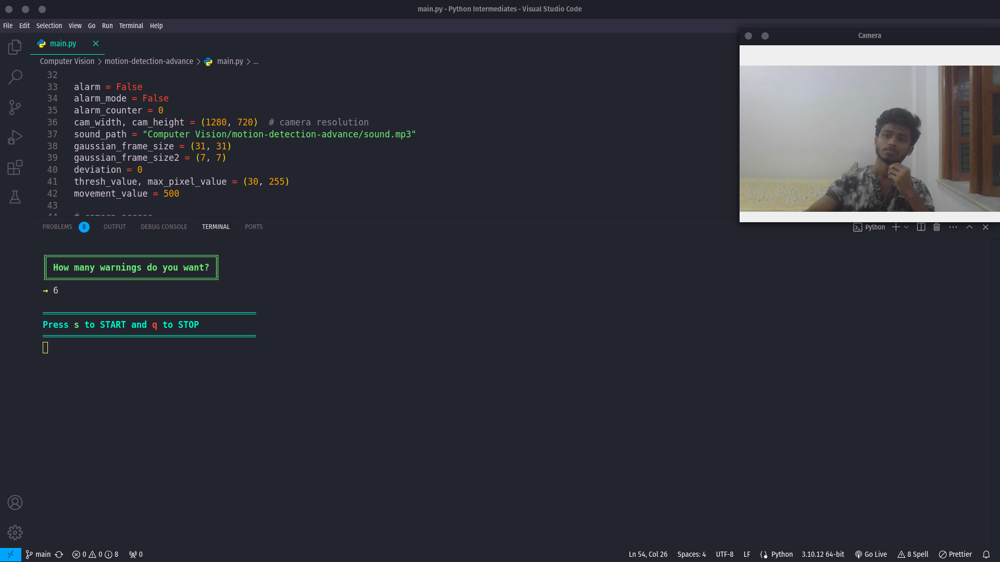
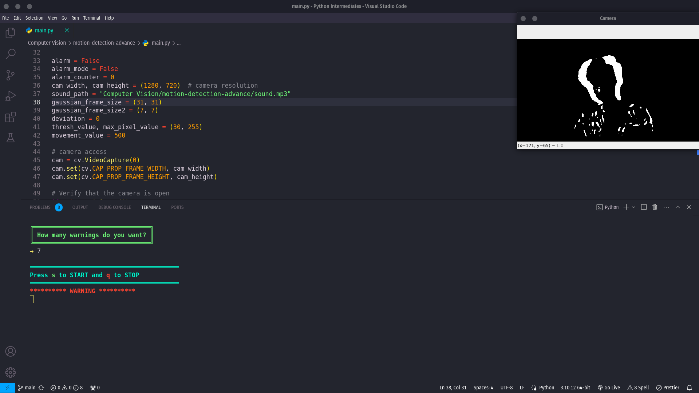

<h1>Motion Detection System</h1>

    <strong>Author:</strong> Arka Chakraborty 
    <strong>Project Type:</strong> Personal Project

<h2>Project Overview</h2>
    

        This project implements a real-time motion detection system using OpenCV and Python. 
        The system captures video input from a webcam, detects motion in the video feed, and triggers an alert 
        when significant motion is detected. The alert includes a visual warning in the terminal and an audible sound.
    

<h2>Features</h2>
    <ul>
        <li>Real-time motion detection using a webcam.</li>
        <li>Customizable alert system with sound notifications.</li>
        <li>User-friendly terminal interface with stylish and eye-catching output.</li>
        <li>Adjustable parameters for professional-level motion detection sensitivity.</li>
    </ul>

<h2>Project Structure</h2>
    <pre>
    MotionGuardian/
    ├── main.py                # Main script for the motion detection system
    ├── sound.mp3              # Alert sound file
    ├── README.html            # Project documentation
    └── screenshots/           # Folder containing output screenshots
    </pre>

<h2>Installation and Usage</h2>
    

        1. Clone the repository to your local machine:
    

    <pre><code>git clone https://github.com/Dark-Programer/MotionGuardian.git</code></pre>

    2. Navigate to the project directory and install the required Python packages:

    <pre><code>pip install -r requirements.txt</code></pre>

    3. Run the <code>main.py</code> script:

    <pre><code>python main.py</code></pre>

    4. Follow the on-screen instructions to start and stop the motion detection.

<h2>Parameter Settings</h2>
    
For optimal performance, the following parameter values are recommended:

    <ul>
        <li><strong>movement_value:</strong> 500</li>
        <li><strong>cam_width:</strong> 1280</li>
        <li><strong>cam_height:</strong> 720</li>
        <li><strong>gaussian_frame_size:</strong> (31, 31)</li>
        <li><strong>gaussian_frame_size2:</strong> (7, 7)</li>
        <li><strong>thresh_value:</strong> 30</li>
    </ul>

<h2>Screenshots</h2>
    
Below are some screenshots of the terminal output and the motion detection system in action:

    

        
        
    

<h2>Acknowledgments</h2>
    

        Special thanks to the OpenCV community for providing powerful tools for computer vision projects.
    
